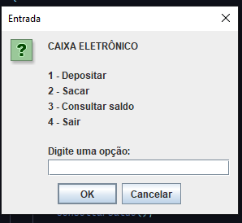
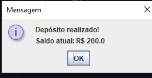

# ATM System

A simple **Java** project that simulates the basic operations of an ATM through a simple interface.

## Features

* Check balance
* Make deposits
* Make withdrawals
* Perform other operations available in the system menu

## Demonstration

### Initial Menu

### Executing an Action

## Technologies

* Java
* IntelliJ IDEA
* Git & GitHub

## Purpose

This project was developed to practice **Java fundamentals**, including variables, methods, conditional statements, user input, and basic project organization.

## Author

**Bryan Fernandes**
